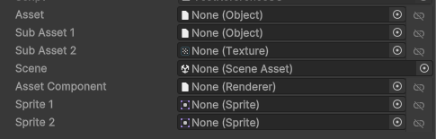

# Reference Package for Unity

This is a general purpose package that gives ability to work with asset references in your project in async paradigm.

## Installation
> [!WARNING]
> package name changed from `com.blackbone.assets` to `com.blackbone.reference`


Simply add as git package in unity or a line below to `manifest.json`

`"com.blackbone.reference": "https://github.com/blackbone/reference.git#v0.3.0"`

## Usage

* Define serialized fields of necessary type instead of using direct ones or AssetReference.
* Use async api to access assets regardless of it's referencing kind.
* Control the way asset is referenced in directly in inspector.

### Reference Definition

Define references as follow:

```csharp
[SerializeField] private Reference asset;
[SerializeField] private Reference subAsset1;
[SerializeField] private Reference<Texture> subAsset2;
[SerializeField] private ReferenceScene scene;
[SerializeField] private Reference<Renderer> assetComponent;
[SerializeField] private Reference<Sprite> sprite1;
[SerializeField] private Reference<Sprite> sprite2;
```

And you'll get following editor:



From left to right description of fields:
* Field label - standard to unity field name
* Object field - is where you manage your reference
* Link selected - this one toggles direct \ indirect link. In other words switching between _direct_ reference and _ResourceProvider_ reference.

### Usage

Usage is pretty straightforward and very similar to use of Addressables, some example code snippet are below:
Here's some examples:

Generic asset loading:
```csharp
Reference assetReference = new Reference(); // let's imagine it's a serialized field
UniTask<UnityEngine.Object> task = assetReference.LoadAsync(); // progress and cancellation token are optional arguments
UnityEngine.Object asset = await task;

// asset ready to use
// using asset ...
            
assetReference.Release(asset); // releasing handle to decrement ref count, other stuff will be handled by system
```
GameObject instantiation:
```csharp
Reference<UnityEngine.GameObject> assetReference = new Reference<UnityEngine.GameObject>();  // let's imagine it's a serialized field
UniTask<UnityEngine.GameObject> task = assetReference.InstantiateAsync(); // parent, position stays, progress and cancellation token are optional arguments
UnityEngine.GameObject instance = await task;

// asset ready to use
// using asset ...

UnityEngine.Object.Destroy(instance); // no need to release reference, system will take care of instances
```
Component instantiation:
```csharp
Reference<UnityEngine.Animator> assetReference = new Reference<UnityEngine.Animator>();  // let's imagine it's a serialized field
UniTask<UnityEngine.Animator> task = assetReference.InstantiateAsync(); // parent, position stays, progress and cancellation token are optional arguments
UnityEngine.Animator instance = await task;

// asset ready to use
// using asset ...

UnityEngine.Object.Destroy(instance.gameObject); // no need to release reference, system will take care of instances
```
Scene loading:
```csharp
ReferenceScene sceneReference = new ReferenceScene();  // let's imagine it's a serialized field
UniTask<UnityEngine.SceneManagement.Scene> task = sceneReference.LoadSceneAsync(); // load scene mode, additive, progress and cancellation token are optional arguments
UnityEngine.SceneManagement.Scene scene = await task;

// scene ready to use
// using scene ...

await UnityEngine.SceneManagement.SceneManager.LoadSceneAsync(0).ToUniTask(); // load other scene
sceneReference.Release(scene); // release of scene so resource manager can free resources
```

## Package support

### [UniTask](https://github.com/Cysharp/UniTask)

This package supports UniTask and it will be used if added to project, no need for defines or code changes.

### [Addressables](https://docs.unity3d.com/Manual/com.unity.addressables.html)

This package is mostly designed to use addressables as underlaying resource manager and it will be used as default if added to project.
But you also free to adapt your own res manager by implementing **IAssetService** interface and registering it by setting **AssetService.Current** before trying to use any Reference.